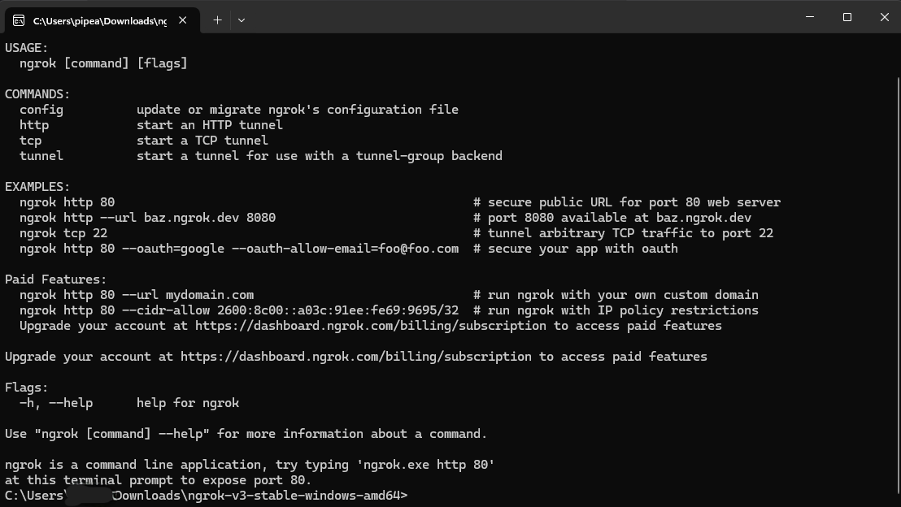

# NGROK
> ***Uso basico del servicio Ngrok***

## Instalacion
Ngrok se puede utilizar con el ejecutable en cada directorio o se puede configurar para que funcione en todo el sistema. 

---

### Uso Mediante Ejecutable
* Ingresar a la web de Ngrok y loguearse: [Ngrok](https://ngrok.com/)

* Dirigirse a **Getting Started (Setup  & Installation)**

* Seleccionar SO

* Click en **Download** y luego la Click en la arquitectura (64 o 32 bits)

* Puede que el antivirus niegue la descarga pero relax, esto se puede deber a que Ngrok permite exponer servicios locales al publico u otros factores, pero no hay de que preocuparse, nuestro bb no sera afectado. Entonces tendremos que desctivar el antivirus de manera temporal para su descarga y descomprimir el zip.

* Una vez se haya descromprimido el zip tendremos un carpeta la cual tendra el ejecutable.

* Para mejor uso del servicio Ngrok, hay que autenticarse 
    * Entrar a la carpeta y ejecutar **ngrok.exe**
    * Tendremos algo asi:

    

    * No dirigimos a la web de **Ngrok** y copiamos el token. Esta debajo del btn **Donwload**

    * Pegamos el token en el ejecutable anterior y damos enter (obviamente)

    * Listo, ya estara la autenticacion. Cerrar el ejecutable 

* Luego para levantar el tunel tendremo que ubicar ek ejecutable **Negrok.exe** en la carpeta raiz de nuestro proyecto (Asi sera para cada proyecto).

* Una vez ubicada, lanzamos la terminal en la direccion del ejecutable

* En la terminal ejecutamos el siguiente comando: ./ngrok.exe http (puerto) - (Si llega a dar erro entonces quitar **./**)

* Y listo, ahi tendremos el servirdor corriendo y la url para compartir

> De esta manera se tendra que llevar el ejecutable a cada directorio o carpeta donde se quiera ejecutar. Si a la hora de ejecutar el ngrok arroja un error es porque no hay autenticacion 

---

### Funcionamiento en todo el sistema
Aqui hay dos formas, se puede hacer de manera manual o automatizada usando Chocolatey.

* #### Manual  
    * La carpeta que contiene el ejectuable se puede renombrar a **'ngrok'** para facil uso

    * Una vez renombrada, ubicar la carpeta en el disco local (Se puede ubicar en cualquier lugar)

    * Copaimos la ruta de la carpeta. Ejemplo: **'C:\ngrok'**

    * Buscamos en el buscador :trollface: del equipo **'variables de entorno'** y clickeamos aqui:

        

    * Click en **'Variables de entorno...'**

    * En las variables del sistema, ubicarse en variable Path y hacer clic en Editar

    * Hacer clic en Nuevo y agregar la ruta de la carpeta (por ejemplo, C:\ngrok).

    * Click **'Aceptar'** hasta cerrar las ventaanas relacionadad con las Variables de Entorno

    * Abrir la terminal y mandar: **'ngrok -v'** - Si muestra la version todo esta bien.

    * Por ultimo queda ejecutar **ngrok http (puerto)** en la terminal de tu directorio

---

* #### Usando Chocolate
    > No es necesario instalar el ejecutable

    * Ingresar a la web de instalacion de choco: [Chocolatey](https://chocolatey.org/install)

    * Copiar el comando de instalacion ubicado en la seccion **'Install Chocolatey for Individual Use:'**

    * Abrir el PowerShell con permisos de admin y enviar el comando

    * Luego Ingresar a la web de Ngrok: [Ngrok](https://ngrok.com/)

    * Dirigirse a **Getting Started (Setup  & Installation)**

    * Ubicarse en **Chocolatey**

    * Copia el comando: **'choco install ngrok'**

    * Abrir nuevamente la terminal con permisos y mandar el comando: **'choco install ngrok'**

    * Escribir **'yes'** y dar enter

    * Verificar instalacion: **ngrok -v**

    * Autenticarse si aun no se ha echo

    * Por ultimo queda ejecutar **ngrok http (puerto)** en la terminal de tu directorio

---

<h2 id="referencias">Referencias 📚</h2>

Video Tutoriales de donde obtuve la información (Si no se entiende ni pio, pueden ver los tutoriales):

> Este de aqui explica el funcionamiento de ngrok en todo el sitema de manera manual
* [NGROK SETUP (WINDOWS)](https://youtu.be/XhRmn9Y8Agk?list=PLNfAFIq5pE5WbX4GT2AuCPflNuW6KkU3j "Tutorial") - CyberRyker

> Este de aqui explica el funcionamiento de ngrok en todo el sitema con Chocolatey
* [Ngrok - Comparte tu localhost con un Dominio y HTTPS](https://youtu.be/iAgJ6eCgUIA?list=PLNfAFIq5pE5WbX4GT2AuCPflNuW6KkU3j) - Fazt Code

* [Documentacion de Ngrok](https://ngrok.com/docs/)

